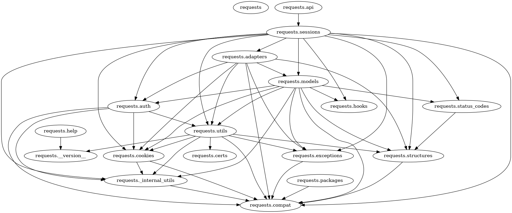
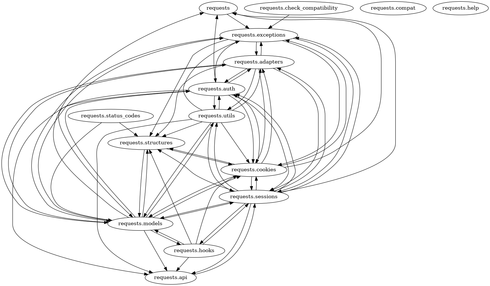
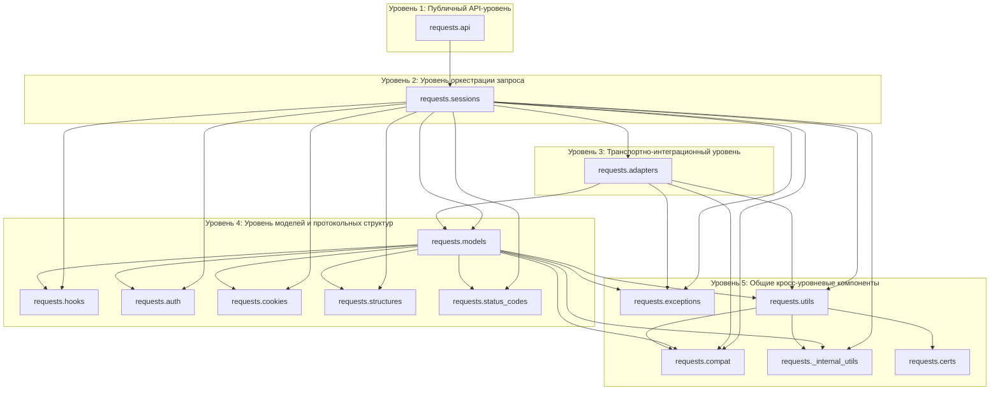

# Отчет по анализу архитектуры

## 1. Выбор проекта
- **Проект:** Requests
- **Репозиторий:** https://github.com/psf/requests
- **Язык проекта:** Python

---

## 2. Использованные инструменты анализа

### 2.1 `networkx` + AST-скрипт (import-graph)
- Построен направленный граф зависимостей между модулями `src/requests/*.py`.
- Использован для:
  - выявления направлений зависимостей,
  - оценки coupling (через степени вершин),
  - проверки циклических зависимостей.

### 2.2 `pyan3` (call-graph)
- Построен граф вызовов по исходникам `requests`.
- Дополнительно сделана агрегация до уровня модулей.

### 2.3 `radon` (сложность и поддерживаемость)
- Получены метрики cyclomatic complexity и Maintainability Index.

---

## 3. Определение архитектурного стиля

На практике архитектура выглядит как многоуровневая
- `requests.api` — фасадный вход (удобные функции API),
- `requests.sessions` — orchestration (подготовка/отправка/редиректы/hooks),
- `requests.models` — доменные сущности и подготовка данных (`Request`, `PreparedRequest`, `Response`),
- `requests.adapters` — инфраструктурный транспорт (вызовы urllib3).

Ключевая цепочка: `api -> sessions -> adapters/models`.

---

## 4. Архитектурные элементы

### 4.1 Основные компоненты
- `requests.api` — точка входа уровня библиотеки.
- `requests.sessions` — центральный координирующий модуль.
- `requests.adapters` — транспортный уровень.
- `requests.models` — подготовка и представление запроса/ответа.
- `requests.hooks`, `requests.auth`, `requests.cookies`, `requests.utils`, `requests.exceptions` — поддерживающие подсистемы.

### 4.2 Зависимости между компонентами
По import-graph:
- `requests.api -> requests.sessions`
- `requests.sessions` зависит от `adapters`, `models`, `auth`, `cookies`, `hooks`, `exceptions`, `utils`, `compat`, `structures`, `status_codes`
- `requests.models` и `requests.adapters` также выступают центрами связей.

### 4.3 Архитектурные уровни
- **Публичный API-уровень:** `requests.api` как внешний интерфейс библиотеки.
- **Уровень оркестрации запроса:** `requests.sessions` (сборка сценария отправки, редиректы, hooks-пайплайн, настройка окружения).
- **Транспортно-интеграционный уровень:** `requests.adapters` (интеграция с urllib3 и фактическая отправка HTTP-запроса).
- **Уровень моделей и протокольных структур:** `requests.models`, `requests.auth`, `requests.cookies`, `requests.hooks`, `requests.structures`, `requests.status_codes`.
- **Общие кросс-уровневые компоненты:** `requests.exceptions`, `requests.compat`, `requests._internal_utils`, `requests.certs` и частично `requests.utils`.

---

## 5. Анализ архитектурных характеристик

### 5.1 Модульность
- Модули разделены по функциональным ролям.
- На уровне import-зависимостей структура направленная и читаемая.

### 5.2 Coupling (межмодульная связанность)
Сводка import-graph:
- Узлы: **18**
- Ребра: **47**
- Плотность: **0.1536**

Хабы по `out-degree`:
- `requests.sessions`: 11
- `requests.models`: 9
- `requests.adapters`: 7
- `requests.utils`: 7

### 5.3 Cohesion (внутримодульная связность)
- `sessions` сосредоточен на orchestration сценария отправки.
- `adapters` сфокусирован на низкоуровневой отправке.
- `models` аккумулирует подготовку `PreparedRequest` и обработку `Response`.
- Повышенная сложность в `models`/`utils` ожидаема из-за широкой функциональной зоны.

### 5.4 Циклические зависимости
- На уровне **import-graph циклы не обнаружены**:  
  `Acyclic among included modules: True`
- На агрегированном call-graph есть SCC размером 11 (это цикличные цепочки вызовов, не циклы импортов).

---

## 6. Архитектурные паттерны

### 6.1 Facade
- `requests.api.request()` создает `Session` и делегирует в `session.request()`.

### 6.2 Strategy / Adapter
- `Session.get_adapter()` выбирает адаптер по URL-префиксу.
- `HTTPAdapter.send()` инкапсулирует транспортный путь отправки.

### 6.3 Builder
- `PreparedRequest.prepare()` собирает запрос через последовательность `prepare_*` методов.

### 6.4 Hook/Event-like
- `hooks.dispatch_hook()` применяет обработчики response hooks.

---

## 7. Сравнение ручного и автоматического анализа

### 7.1 Совпадения
- Оба подхода показывают, что ключевые центры связности находятся в `requests.sessions`, `requests.models` и `requests.adapters`.
- Оба подхода подтверждают роль `requests.api` как интерфейса и то, что основной поток запроса проходит через `Session`.
- На уровне фактов о зависимостях выводы совпадают: import-граф ацикличен, а call-граф дает более плотную картину взаимодействий.

### 7.2 Различия
- **Что дал автоматический анализ:**
  - количественные характеристики структуры (`18` узлов, `47` ребер, плотность `0.1536`);
  - ranking модулей-хабов по связанности;
  - факт отсутствия import-циклов;
- **Что дал ручной анализ:**
  - интерпретацию ролей модулей и их группировку в уровни;
  - архитектурное объяснение цепочки `api -> sessions -> adapters/models`;
- **Ключевой момент:** автоматический анализ сам по себе не выделяет уровни архитектуры. Он показывает графы и метрики, а выделение уровней — результат ручной интерпретации структуры и ответственности модулей.

### 7.3 Ограничения анализаторов
- **Что не выявляется автоматически в явном виде:**
  1. Границы ответственности между модулями с точки зрения архитектурного дизайна.
  2. Разделение на уровни и обоснование, почему конкретный модуль относится именно к этому уровню.
  3. Архитектурные риски (например, постепенный рост “центральных” модулей и усложнение изменений из-за публичного API).
- **Технические ограничения автоматического анализа:**
  - статический import-анализ не видит часть runtime-поведения;
  - call-граф приближенный и может содержать неточности;

---

## 8. Визуализация архитектуры

### 8.1 Файлы визуализации
- `requests_arch_analysis/output/import_graph.png`
- `requests_arch_analysis/output/call_graph_modules.png`

### 8.2 Mermaid-схема (обобщенный вид)

---

## 9. Итоговый вывод
- Зависимости между модулями направленные и без import-циклов.
- Основная нагрузка по связям и логике находится в `sessions`, `models`, `adapters`.

---

## 10. Рекомендации по улучшению

### 10.1 Выявленные проблемы
1. **Высокая концентрация ответственности в центральных модулях**
   - `requests.sessions` и `requests.models` зависят от многих частей системы, поэтому любые изменения в них затрагивают сразу много сценариев.
2. **Крупный общий слой (`Shared / Cross-cutting`)**
   - в общий слой попало слишком много модулей (`exceptions`, `compat`, `_internal_utils`, `certs`, `utils`), поэтому границы между уровнями становятся менее понятными.

### 10.2 Предложения по улучшению
1. **Сократить и структурировать общий слой**
   - разделить общий слой на понятные группы: совместимость, ошибки, низкоуровневые утилиты;
   - оставить в нем только то, что действительно используется в разных уровнях.
2. **Декомпозировать `sessions` по ролям**
   - разделить `sessions` на более узкие части: редиректы, hooks, настройки окружения, отправка запроса.
3. **Локально уменьшить сложность в `models` и `utils`**
   - разбить крупные функции и методы на более короткие и специализированные.
4. **Ограничить архитектурный дрейф автоматическими проверками**
   - добавить проверки в CI: отсутствие циклов импортов, пороги сложности, контроль роста связности и размера общего слоя.

### 10.3 Улучшаемые свойства
Предлагаемые изменения улучшают:
- **Модульность:** более четкие границы между уровнями и уменьшение “серой зоны” общего слоя.
- **Поддерживаемость:** проще понимать, где должна находиться новая логика и кто за нее отвечает.
- **Тестируемость:** меньшие компоненты с ясной ролью проще изолировать в тестах.
- **Предсказуемость изменений:** меньше неожиданных эффектов при правках центральных сценариев.
- **Долговременная устойчивость архитектуры:** ниже риск, что общий слой превратится в «склад всего подряд».

### 10.4 Оценка реализуемости
Изменения реалистично внедрять по шагам. Сначала лучше навести порядок в общем слое и закрепить простые правила, что туда можно добавлять. Это самый безопасный этап. Затем стоит разделить `sessions` на несколько частей по ответственности — это сложнее, потому что модуль участвует в ключевом пути отправки запроса. После этого можно локально упростить сложные места в `models` и `utils`. Если делать изменения небольшими итерациями и сопровождать их тестами на основные сценарии (редиректы, hooks, auth, proxy), риск регрессий будет умеренным, а выигрыш в поддерживаемости — заметным.
