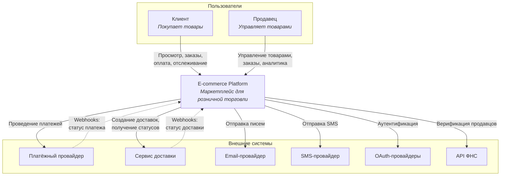
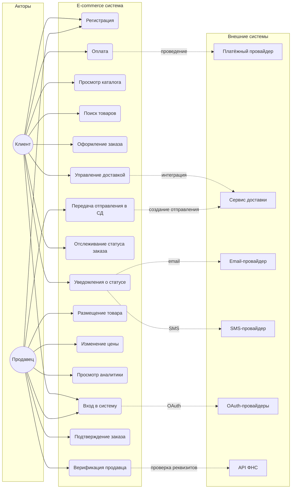
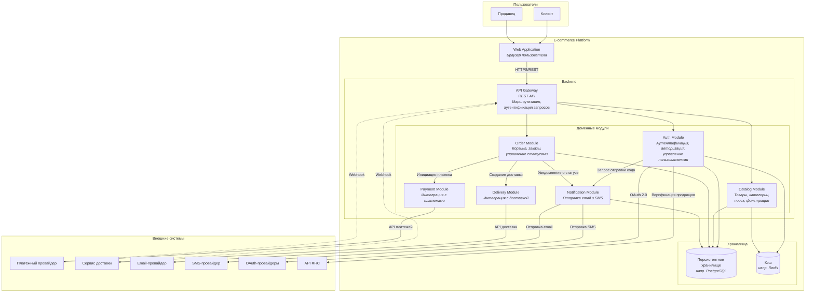
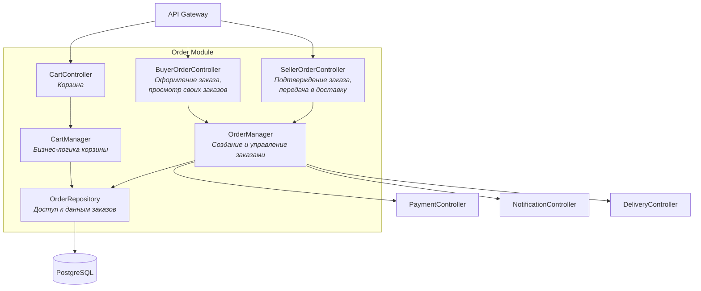
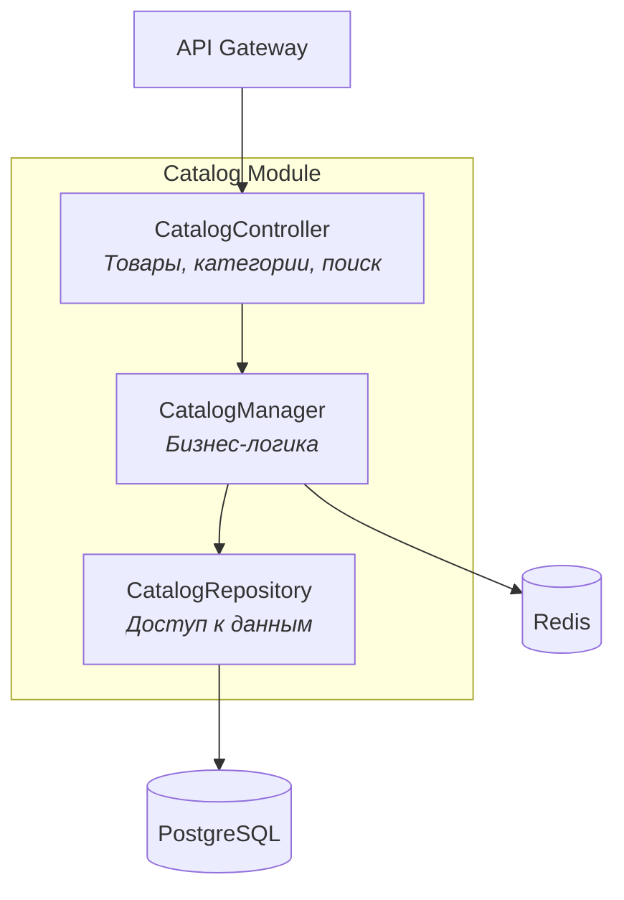
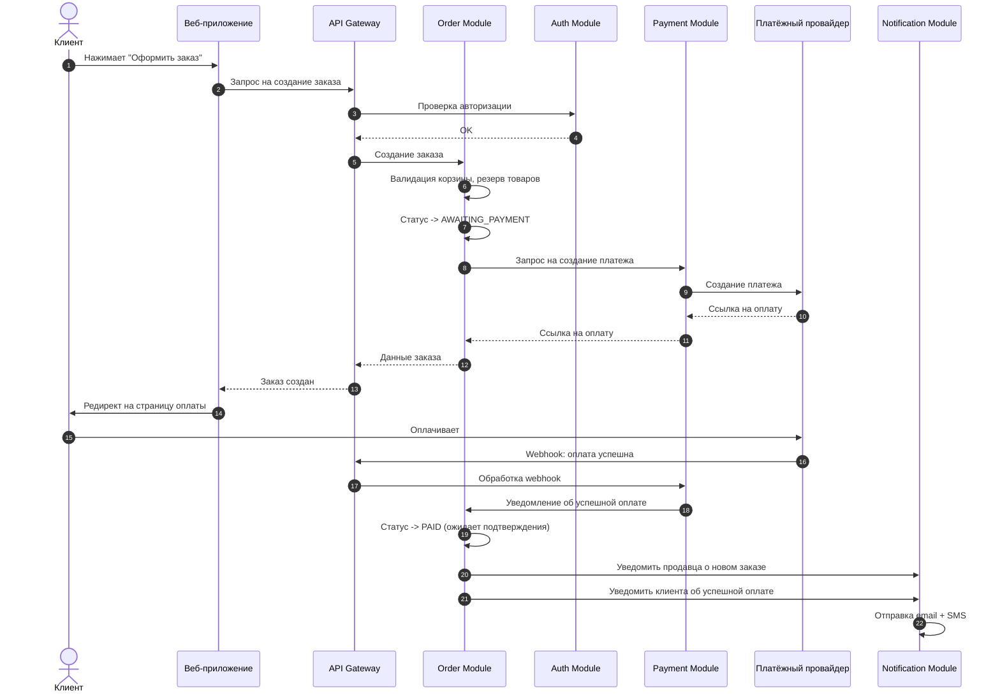
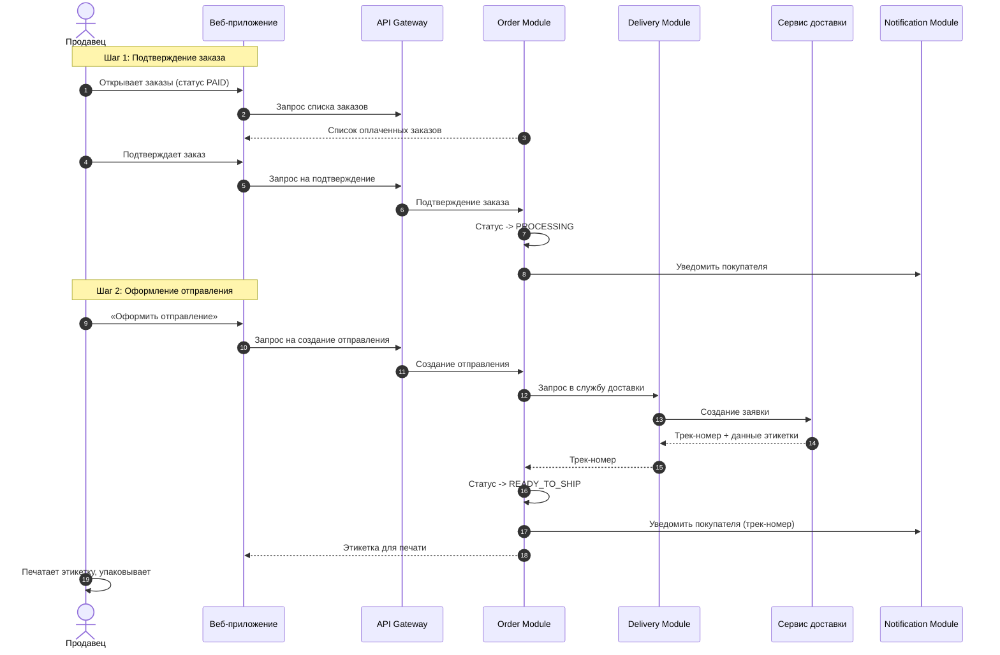
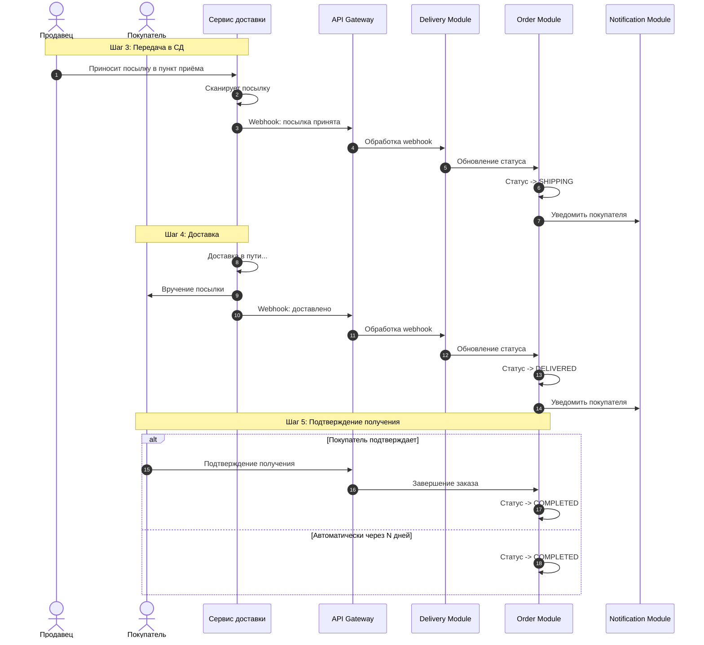
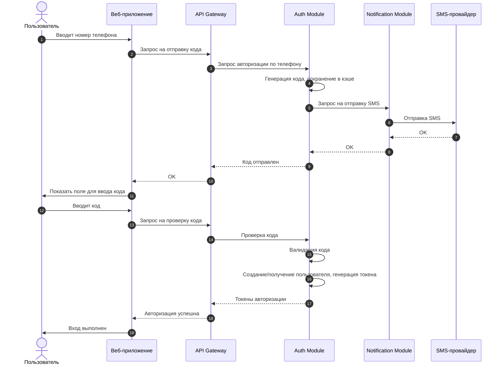

# Архитектура системы e-commerce

Практическое задание № 1 - проектирование архитектуры программной системы для предметной области электронной коммерции.

Цель: спроектировать архитектуру маркетплейса по типу AliExpress, Ozon или Wildberries, но без собственной службы доставки - для этой функции используются внешние провайдеры.

---

## Оглавление

1. [Предметная область](#1-предметная-область)
2. [Архитектурный контекст (C4 Level 1)](#2-архитектурный-контекст-c4-level-1)
3. [Контейнеры системы (C4 Level 2)](#3-контейнеры-системы-c4-level-2)
4. [Компоненты системы (C4 Level 3)](#4-компоненты-системы-c4-level-3)
5. [Sequence Diagrams](#5-sequence-diagrams)
6. [Архитектурный стиль и решения](#6-архитектурный-стиль-и-решения)
7. [Функциональные требования](#7-функциональные-требования)
8. [Нефункциональные требования](#8-нефункциональные-требования)

---

## 1. Предметная область

### 1.1. Бизнес-контекст

Система представляет собой маркетплейс B2C с поддержкой множества продавцов. Платформа объединяет покупателей и продавцов, предоставляя инструменты для торговли, но не владеет собственной логистикой - эта функция делегируется внешним провайдерам. Для продавцов предусмотрена верификация юридических реквизитов через API ФНС.

### 1.2. Доменная модель

| Сущность | Описание | Ключевые атрибуты |
|----------|----------|-------------------|
| Товар | Единица продажи в каталоге | ID, цена, описание, остаток, категория, продавец |
| Покупатель | Пользователь-клиент | ID, контакты (телефон, email), адреса доставки, история заказов |
| Продавец | Пользователь-бизнес | ID, контакты, реквизиты, статус верификации, разрешённые службы доставки |
| Заказ | Зафиксированная сделка | ID, позиции (снимок товаров), жизненный цикл статусов (см. ниже), способ оплаты, служба доставки (из разрешённых продавцом), адрес |
| Корзина | Временный набор товаров | ID пользователя, список {товар, количество}, TTL |
| Каталог | Агрегат товаров | Иерархия категорий, индексы для поиска и фильтрации |

### 1.3. Роли и возможности

| Роль | Возможности |
|------|-------------|
| Клиент | Просмотр каталога, поиск, корзина, оформление заказа (выбор службы доставки из разрешённых продавцом), оплата, отслеживание доставки, получение уведомлений |
| Продавец | Регистрация с юр. реквизитами, верификация через ФНС, настройка разрешённых служб доставки, управление товарами и ценами, подтверждение заказов, передача отправления в службу доставки, аналитика продаж |

### 1.4. Способы аутентификации

- Логин/пароль
- OAuth (Google, VK, Яндекс и др.)
- Вход по телефону (SMS-код)
- Вход по email (код или magic link)

### 1.5. Жизненный цикл заказа и статусы

| Статус | Описание | Кто переводит |
|--------|----------|----------------|
| AWAITING_PAYMENT | Заказ создан, ожидается оплата от клиента | Система |
| PAID | Оплата прошла, заказ ждёт проверки продавцом | Система |
| PROCESSING | Продавец подтвердил заказ, готовит к отправке | Продавец |
| READY_TO_SHIP | Продавец оформил отправление, получил этикетку и трек-номер | Продавец |
| SHIPPING | Служба доставки приняла посылку, в пути | Система (webhook от СД) |
| DELIVERED | Доставлено получателю | Система (webhook от СД) |
| COMPLETED | Покупатель подтвердил получение | Покупатель / Система (авто) |
| CANCELLED | Заказ отменён на любом этапе | Покупатель / Продавец / Система |

### 1.6. Процесс передачи заказа в доставку

Процесс организован по модели маркетплейсов (AliExpress, Ozon):

Шаг 1. Подтверждение заказа (PAID -> PROCESSING)

- Продавец видит новый оплаченный заказ в личном кабинете
- Проверяет наличие товара и подтверждает заказ
- Начинает сборку и упаковку

Шаг 2. Оформление отправления (PROCESSING -> READY_TO_SHIP)

- Продавец нажимает «Оформить отправление» в личном кабинете
- Система создаёт заявку в службе доставки (выбранной покупателем из разрешённых)
- Служба доставки возвращает трек-номер и данные для этикетки
- Продавец печатает этикетку и наклеивает на посылку
- Статус меняется на READY_TO_SHIP - покупатель видит трек-номер

Шаг 3. Передача в службу доставки (READY_TO_SHIP -> SHIPPING)

- Продавец относит посылку в пункт приёма службы доставки
- Служба доставки сканирует посылку при приёмке
- Webhook от СД уведомляет систему -> статус автоматически меняется на SHIPPING
- Продавцу не нужно вручную отмечать передачу - это делает СД

Шаг 4. Доставка и завершение (SHIPPING -> DELIVERED -> COMPLETED)

- Служба доставки обновляет статус по мере движения посылки (webhooks)
- При вручении получателю -> DELIVERED
- Покупатель подтверждает получение -> COMPLETED
- Если покупатель не подтвердил за N дней - автоматический перевод в COMPLETED

Отмена заказа (-> CANCELLED)

- До отправки: покупатель или продавец могут отменить
- После отправки: только через процедуру возврата

---

## 2. Архитектурный контекст (C4 Level 1)

### 2.1. Назначение системы

Маркетплейс для розничной торговли: клиенты ищут товары, оформляют заказы, оплачивают и отслеживают доставку; продавцы управляют ассортиментом, ценами и анализируют продажи.

### 2.2. Границы системы

| Внутри системы | Вне системы |
|----------------|-------------|
| Web-приложение | Пользователи (клиенты, продавцы) |
| Backend API | Платёжные провайдеры |
| Доменные модули | Службы доставки |
| Хранилища данных | Email/SMS-провайдеры |
| | OAuth-провайдеры |
| | API ФНС |

### 2.3. Внешние системы и интеграции

| Внешняя система | Протокол | Назначение | Направление |
|-----------------|----------|------------|-------------|
| Платёжный провайдер | REST API + Webhooks | Приём платежей, возвраты | Исходящий + входящий (callback) |
| Сервис доставки | REST API + Webhooks | Создание отправлений, трекинг статусов | Исходящий + входящий (callback) |
| Email-провайдер | REST API | Отправка писем (коды, уведомления) | Исходящий |
| SMS-провайдер | REST API | Отправка SMS (коды, уведомления) | Исходящий |
| OAuth-провайдеры | OAuth 2.0 | Социальный вход | Исходящий |
| API ФНС | REST API | Верификация юр. реквизитов продавцов | Исходящий |

### 2.4. Диаграмма системного контекста (C4)

### 2.5. Диаграмма вариантов использования (Use Case)

---

## 3. Контейнеры системы (C4 Level 2)

### 3.1. Диаграмма контейнеров

### 3.2. Описание контейнеров

| Контейнер | Ответственность |
|-----------|-----------------|
| Web Application | Пользовательский интерфейс, работа в браузере |
| API Gateway | Единая точка входа, маршрутизация, JWT-валидация |
| Auth Module | Регистрация, вход (пароль, OAuth, SMS, email), JWT/сессии, роли, верификация продавцов через ФНС |
| Catalog Module | CRUD товаров, категории, полнотекстовый поиск, фильтрация |
| Order Module | Корзина, создание заказов, управление статусами заказа; интерфейс для продавца: подтверждение заказа, передача в доставку |
| Payment Module | Адаптер к внешним платёжным провайдерам, обработка платежей и возвратов |
| Notification Module | Единая точка отправки email/SMS, шаблонизация |
| Delivery Module | Адаптер к внешним API доставки, маппинг статусов |
| Персистентное хранилище | Хранение пользователей, товаров, заказов (например PostgreSQL) |
| Кэш | Кэш каталога, сессии (например Redis) |

---

## 4. Компоненты системы (C4 Level 3)

Детализация внутренней структуры ключевых контейнеров. Примеры особенно сложных систем

### 4.1. Диаграмма компонентов Order Module

### 4.2. Диаграмма компонентов Catalog Module

### 4.3. Матрица зависимостей модулей

| Модуль ↓ зависит от -> | Auth | Catalog | Order | Payment | Notify | Delivery | Внешние системы |
|------------------------|:----:|:-------:|:-----:|:-------:|:------:|:--------:|-----------------|
| Auth Module | - | - | - | - | ✓ | - | OAuth, ФНС |
| Catalog Module | - | - | - | - | - | - | - |
| Order Module | - | - | - | ✓ | ✓ | ✓ | - |
| Payment Module | - | - | - | - | - | - | Платёжный провайдер |
| Notification Module | - | - | - | - | - | - | Email, SMS |
| Delivery Module | - | - | - | - | - | - | Сервис доставки |

Принципы зависимостей:

- Catalog Module не имеет внешних зависимостей
- Notification Module - единая точка для всех исходящих сообщений
- Payment Module и Delivery Module - адаптеры к внешним системам
- Order Module - координирует платёж, доставку, уведомления

---

## 5. Sequence Diagrams

### 5.1. Оформление заказа и оплата

Дальнейшие шаги (подтверждение продавцом, передача в доставку) - см. раздел 5.3.

### 5.3. Подтверждение заказа продавцом и оформление отправления

### 5.4. Приёмка посылки службой доставки и доставка

### 5.2. Вход по телефону (SMS-код)

---

## 6. Архитектурный стиль и решения

### 6.1. Выбор архитектурного стиля

Выбранный стиль: Модульный монолит с чётким разделением на доменные модули.

| Критерий | Модульный монолит | Микросервисы | Обоснование выбора |
|----------|-------------------|--------------|-------------------|
| Сложность разработки | Низкая | Высокая | Единая кодовая база, простой рефакторинг |
| Сложность развёртывания | Низкая | Высокая | Один артефакт, упрощённый CI/CD |
| Латентность между модулями | Наносекунды (in-process) | Миллисекунды (network) | Критично для checkout-процесса |
| Масштабирование | Вертикальное + горизонтальное (реплики) | Независимое по сервисам | Достаточно для начального этапа |
| Эволюция в микросервисы | Возможна | - | Модули можно выносить по мере роста |

Жертвуем независимым масштабированием отдельных функций ради простоты и скорости разработки на старте. Модульные границы позволят при необходимости вынести каталог или уведомления в отдельные микросервисы.

### 6.2. Архитектурный паттерн: Controller + Manager + Repository/Adapter

Внутри каждого модуля используется трёхслойная структура:

| Слой | Назначение | Примеры |
|------|------------|---------|
| Controller | Обработка HTTP-запросов, валидация входных данных, маршрутизация | OrderController, CatalogController |
| Manager | Бизнес-логика, оркестрация операций | OrderManager, CartManager |
| Repository / Adapter | Доступ к данным (Repository) или интеграция с внешними системами (Adapter) | OrderRepository, PaymentAdapter, EmailAdapter |

При межмодульном взаимодействии один модуль обращается к Controller другого модуля (а не напрямую к Manager), что обеспечивает чёткие границы и контракты между модулями.

### 6.3. Асинхронная обработка

Изначально система спроектирована с учётом асинхронной обработки операций, где это возможно:

- Отправка уведомлений (email, SMS) выполняется асинхронно
- Обработка webhook от платёжного провайдера и служб доставки
- Обновление статусов заказов

Это позволяет не блокировать пользовательские запросы и обеспечивает устойчивость при временной недоступности внешних сервисов.

### 6.4. Архитектурные решения (ADR)

#### ADR-001: Модульный монолит

| Аспект | Описание |
|--------|----------|
| Контекст | Нужна архитектура, которая позволит быстро развивать продукт на начальном этапе |
| Решение | Модульный монолит с чётким разделением на доменные модули |
| Альтернативы | Микросервисы с самого начала |
| Обоснование | Простота разработки и развёртывания; низкая латентность между модулями; модульные границы позволят при необходимости выделить микросервисы |
| Последствия | (+) Быстрый старт, единая кодовая база. (−) Вертикальное масштабирование, общий деплой |

#### ADR-002: Платежи через внешнего провайдера

| Аспект | Описание |
|--------|----------|
| Контекст | Необходимо принимать онлайн-платежи от клиентов |
| Решение | На начальном этапе - интеграция с внешним платёжным провайдером; данные карт не хранятся и не проходят через систему |
| Альтернативы | Собственный эквайринг с хранением карт (рассматривается как возможная эволюция) |
| Обоснование | PCI DSS compliance - дорого и сложно на старте; провайдеры берут ответственность на себя |
| Последствия | (+) Нет PCI DSS scope, меньше рисков, быстрый запуск. (−) Комиссия провайдера, зависимость от внешнего API. При росте объёмов возможен переход на собственную платёжную систему |

#### ADR-003: Единый Notification Module с отдельными адаптерами

| Аспект | Описание |
|--------|----------|
| Контекст | Несколько модулей должны отправлять уведомления (Auth - коды, Order - статусы) |
| Решение | Выделенный Notification Module как единая точка отправки с отдельными адаптерами для каждого канала (EmailAdapter, SMSAdapter) |
| Альтернативы | Каждый модуль обращается к email/SMS напрямую |
| Обоснование | Единообразие шаблонов, централизованный контроль; адаптеры позволяют легко менять провайдеров |
| Последствия | (+) Единая точка контроля, простая смена провайдера. (−) Дополнительная зависимость между модулями |

#### ADR-004: Кэш для сессий и часто запрашиваемых данных

| Аспект | Описание |
|--------|----------|
| Контекст | Нужен быстрый доступ к часто запрашиваемым данным (каталог) и хранение сессий |
| Решение | Выделенное in-memory хранилище (например Redis) для кэша каталога, сессий |
| Альтернативы | In-process cache |
| Обоснование | TTL, атомарные операции; снижение нагрузки на персистентное хранилище; работает при горизонтальном масштабировании |
| Последствия | (+) Снижение нагрузки на БД, быстрые сессии. (−) Дополнительный компонент инфраструктуры |

### 6.5. Эволюция архитектуры

При росте нагрузки и бизнеса возможны следующие шаги:

1. Load Balancer перед API Gateway - добавление балансировщика нагрузки для распределения запросов между репликами
2. Горизонтальное масштабирование - добавление реплик API и модулей за балансировщиком
3. Выделение любого модуля в отдельный микросервис - модульные границы позволяют при необходимости вынести Catalog, Notification или другой модуль в независимый микросервис
4. Собственная платёжная система - при достижении объёмов, когда экономия на комиссии провайдера превысит затраты на PCI DSS compliance и разработку, возможен переход на собственный эквайринг

---

## 7. Функциональные требования

### 7.1. Управление пользователями

- Регистрация клиента по email или телефону
- Регистрация продавца с указанием реквизитов
- Аутентификация: логин/пароль, OAuth, SMS-код, email magic link
- Управление профилем: контакты, адреса доставки
- Восстановление пароля через email

### 7.2. Каталог и поиск

- Просмотр каталога по категориям
- Полнотекстовый поиск товаров
- Фильтрация по цене, наличию, характеристикам
- Карточка товара: описание, фото, цена, наличие

### 7.3. Заказы и оплата

- Добавление товаров в корзину
- Оформление заказа с выбором адреса и службы доставки (из разрешённых продавцом)
- Онлайн-оплата через платёжного провайдера
- Просмотр истории заказов и текущего статуса
- Отмена заказа (до отправки в СД)
- Подтверждение получения заказа покупателем

### 7.4. Доставка и уведомления

- Выбор службы доставки из списка, разрешённого продавцом
- Отслеживание статуса доставки (трекинг)
- Автоматическое обновление статусов по webhook от службы доставки
- Уведомления о статусе заказа по email и SMS
- Автоматическое завершение заказа через N дней после доставки

### 7.5. Функции продавца

- Верификация юридических реквизитов через API ФНС
- Настройка разрешённых служб доставки для своих товаров
- Добавление и редактирование товаров
- Управление ценами и остатками
- Просмотр аналитики: продажи, остатки, популярные товары
- Просмотр заказов по своим товарам и их статусов
- Подтверждение заказа после проверки наличия
- Оформление отправления: получение трек-номера и этикетки для печати
- Отмена заказа (до передачи в СД)

## 8. Нефункциональные требования

### 8.1 Требования к производительности

- Время отклика системы на поисковый запрос пользователя не должно превышать 2 секунд при средней нагрузке.
- Время загрузки карточки товара не должно превышать 1 секунды в 95% запросов.
- Система должна обрабатывать одновременно не менее 10 000 одновременных пользователей без деградации производительности.

### 8.2 Требования к надежности

- Пользователю, работающему через браузер должен быть предоставлен непрерывный доступ к веб-сайту, расположенному по определенному url-адресу
- Исключен отказ работы веб-сайта и мобильного приложения из-за некорректных действий клиента
- Исключена возможность непреднамеренного завершения работы программных компонент во всех случаях, кроме технических проблем на стороне провайдера серверов
- Веб-сайт и мобильное приложение должны обеспечивать доступность для пользователя не менее 98% времени в месяц

### 8.3 Требования к безопасности

- Платёжные операции безопасны: используется шифрование, хранение данных и обработка платежей осуществляется только через платёжного провайдера.
- Система защищена от основных видов атак Пароли хранятся в зашифрованном виде

### 8.4. Требования к поддерживаемости и расширяемости

- Архитектура системы должна обеспечивать возможность расширения функциональности без значительных изменений существующего кода
- Добавление новых платёжных и логистических провайдеров должно выполняться без изменения бизнес-логики системы
