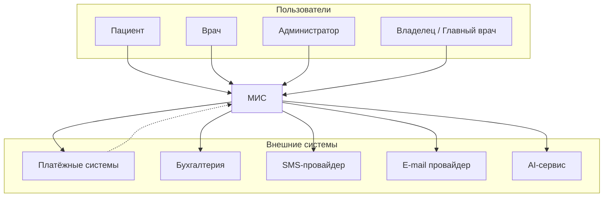
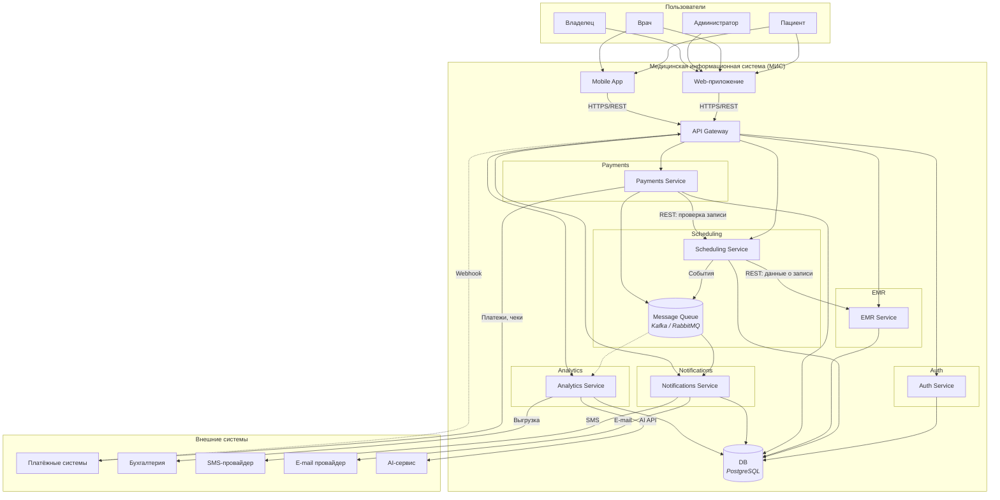

# Архитектурное описание

Архитектурная документация медицинской информационной системы в формате C4: контекст системы (Level 1) и контейнеры (Level 2). Архитектура — **микросервисная**: доменные возможности разнесены по независимо развёртываемым сервисам; используется одна база данных, взаимодействие — через API и шину событий.

---

## 2. Архитектурный контекст (C4 Level 1)

### 2.1. Назначение системы

МИС для сети частных клиник: расписание и запись на приём, онлайн-оплата, медкарты и посещения, уведомления (SMS/e-mail), дашборды и аналитика; интеграция с бухгалтерией и AI-сервисом.

### 2.2. Границы системы

Внутри МИС: Web-приложение, Mobile App, API Gateway, микросервисы (Auth, Scheduling, EMR, Payments, Notifications, Analytics), БД (PostgreSQL), Message Queue. Вне системы: пользователи (пациент, врач, администратор, владелец); платёжные системы, бухгалтерия, SMS/e-mail провайдеры, AI-сервис — интеграция по API, webhooks для платежей.

### 2.3. Диаграмма системного контекста (C4)

---

## 3. Контейнеры системы (C4 Level 2)

Микросервисы и одна БД; взаимодействие через API Gateway (REST) и шину событий.

### 3.1. Диаграмма контейнеров

### 3.2. Описание контейнеров

| Контейнер | Назначение |
|-----------|------------|
| Web-приложение, Mobile App | Интерфейсы для пользователей |
| API Gateway | Точка входа, JWT, маршрутизация, webhooks |
| Auth Service | Аутентификация, RBAC, изоляция по клиникам |
| Scheduling Service | Расписание, слоты, записи, защита от двойной записи |
| EMR Service | Медкарты, посещения, диагнозы, заключения |
| Payments Service | Оплата, фискализация, адаптеры платёжных систем |
| Notifications Service | Уведомления по событиям, шаблоны, SMS/e-mail |
| Analytics Service | Дашборды, отчёты, выгрузка в бухгалтерию, AI |
| DB (PostgreSQL) | Хранение данных всех сервисов |
| Message Queue | Шина событий для уведомлений и аналитики |

---

## 4. Архитектура: детали и решения

### Композиция и связи

Микросервисы (Auth, Scheduling, EMR, Payments, Notifications, Analytics), одна БД (PostgreSQL). Единая точка входа — API Gateway; между сервисами — REST; уведомления и аналитика — через шину событий (Message Queue). Внешние системы (платежи, SMS, e-mail, бухгалтерия, AI) подключаются через адаптеры.

### Хранение и защита данных

Учёт 323-ФЗ, 152-ФЗ и приказов Минздрава: сроки хранения меддокументации, шифрование при передаче и хранении, RBAC и изоляция по клиникам, аудит, размещение БД на территории РФ.

### TODO

Возможно какие-то решения для оптимизаций или в случае ошибок

## 5. Верхнеуровневая оценка реализации МИС

### 1. Вводные и допущения

На основе предоставленной архитектуры и бизнес-требований мы принимаем следующие допущения для оценки:

- MVP-функционал: Оценивается создание ядра системы, которое закроет основные потребности: запись к врачу, ведение электронных медкарт, онлайн-оплата, базовые уведомления и дашборды.

- Команда: Ставки рассчитаны для российской команды разработки (руб.).

- Инфраструктура: Оценка включает настройку инфраструктуры (dev/stage/prod контуры) в одном из российских облаков (Yandex.Cloud / Selectel).

- Интеграции: Считаем, что все внешние сервисы (платежные шлюзы, SMS/Email провайдеры) имеют типовое API.

### 2. Этапы реализации

| **Этап** | **Длительность** | **Ключевые работы (Задачи)** | **Результат** |
| :--- | :--- | :--- | :--- |
| **Этап 1: Проектирование и Настройка (Foundation)** | 1.5 - 2 месяца | - **Анализ и Архитектура:** Детализация API, моделей данных, уточнение интеграций (бухгалтерия, AI), выбор стека технологий.  - **DevOps:** Настройка CI/CD, развертывание инфраструктуры (БД, очереди), настройка мониторинга и логирования. | Готовая к разработке среда, настроенные репозитории, утвержденные технические спецификации и план разработки. |
| **Этап 2: Разработка ядра системы (Backbone + Auth)** | 2.5 - 3 месяца | - **API Gateway:** Разработка единой точки входа.   - **Auth Service:** Регистрация/авторизация, ролевая модель (RBAC), изоляция данных по клиникам, валидация JWT.   - **База данных:** Создание схемы и миграции. | Работоспособный и безопасный бэкенд, готовый для подключения пользовательских интерфейсов и бизнес-логики. |
| **Этап 3: Разработка бизнес-логики (Core Features)** | 4 - 5 месяцев | - **Scheduling Service:** Управление расписанием и записью.  - **EMR Service:** Ведение электронных медкарт и протоколов.  - **Payments Service:** Интеграция с эквайрингом и облачной кассой.  - **Web-App:** Разработка интерфейсов для пациентов, врачей и администраторов. | Готовый продукт для запуска пилота (функции: запись, оплата, электронная карта). |
| **Этап 4: Интеграции и Аналитика (Integration & Analytics)** | 2 - 3 месяца | - **Notifications Service:** Подключение SMS/Email провайдеров, настройка шаблонов уведомлений.  - **Analytics Service:** Построение ETL-процессов, разработка дашбордов для руководства.  - **Внешние интеграции:** Адаптеры для бухгалтерии (ERP) и первый контур интеграции с AI-сервисом.  - **Mobile App (MVP):** Сборка облегченной версии приложения (просмотр расписания, запись, уведомления). | Расширение функционала системами уведомлений, аналитики и внешнего взаимодействия. |
| **Этап 5: Внедрение, Миграция данных и Опытная эксплуатация** | 2 - 3 месяца | - **Миграция:** Перенос данных из Excel и бумажных карт.  - **Тестирование:** Нагрузочное тестирование, регресс, приемочное тестирование (UAT).  - **Развертывание:** Выкатка в промышленную среду (production), обучение персонала. | Система, введенная в промышленную эксплуатацию. |

**Общая длительность:** 12 - 16 месяцев

### 3. Оценка трудозатрат (Человеко-месяцы)

Предполагаемый состав команды:

- **PM/PO:** 1 (ведение проекта)
- **System Analyst:** 1 (спецификации)
- **Backend Developers:** 3-4 (Java/Go/Python, Kafka, SQL)
- **Frontend Developers:** 2-3 (React/Vue.js)
- **Mobile Developer:** 1-2 (Flutter/React Native)
- **QA Engineer:** 2 (тестирование)
- **DevOps Engineer:** 1 (частичная занятость)

| Этап | PM | Аналитик | Backend | Frontend | Mobile | QA | DevOps | **Итого (чел.-мес)** |
| :--- | :---: | :---: | :---: | :---: | :---: | :---: | :---: | :---: |
| **Этап 1** | 1 | 2 | 1 | 0.5 | 0 | 0.5 | 2 | **7** |
| **Этап 2** | 1 | 0.5 | 5 | 1 | 0 | 1.5 | 0.5 | **9.5** |
| **Этап 3** | 2 | 1 | 12 | 8 | 2 | 6 | 0.5 | **31.5** |
| **Этап 4** | 1.5 | 1 | 5 | 3 | 3 | 3 | 0.5 | **17** |
| **Этап 5** | 2 | 1 | 2 | 1 | 0.5 | 3 | 1 | **10.5** |
| **ИТОГО** | **7.5** | **5.5** | **25** | **13.5** | **5.5** | **14** | **4.5** | **75.5** |

**Итоговые трудозатраты: ~75 человеко-месяцев.**

---

### 4. Стоимостная оценка (в рублях)

Используем медианные ставки для российской команды (Москва / СПб, имсключая налоги работодателя):

- PM: 150 000 руб./мес  
- Аналитик: 200 000 руб./мес  
- Backend: 280 000 руб./мес  
- Frontend: 260 000 руб./мес  
- Mobile: 280 000 руб./мес  
- QA: 200 000 руб./мес  
- DevOps: 240 000 руб./мес  

| Роль | Месяцев | Ставка (руб./мес, gross) | Сумма gross (руб.) |
| :--- | :---: | ---: | ---: |
| **PM** | 7.5 | 150 000 | 1 125 000 |
| **Аналитик** | 5.5 | 200 000 | 1 100 000 |
| **Backend** | 25 | 280 000 | 7 000 000 |
| **Frontend** | 13.5 | 260 000 | 3 510 000 |
| **Mobile** | 5.5 | 280 000 | 1 540 000 |
| **QA** | 14 | 200 000 | 2 800 000 |
| **DevOps** | 4.5 | 240 000 | 1 080 000 |
| **ИТОГО ФОТ (gross)** | | | **18 155 000 руб.** |
| **Налоговая нагрузка (+30%)** | | | **5 446 500 руб.** |
| **ВСЕГО расходы на сотрудников** | | | **23 601 500 руб.** |

Итоговая стоимость проекта с учётом страховых взносов и налогов: $\approx$ **23 601 500 руб.**

### 5. Дополнительные расходы (не включены в ФОТ)

Помимо разработки необходимо учитывать эксплуатационные и инфраструктурные затраты.

Инфраструктура:

- Cloud (VM, Kubernetes, БД) — ~200 000 - 500 000 руб./год
- Хранение резервных копий
- Мониторинг и логирование

Интеграции:

- Комиссии платежных систем
- SMS-трафик (зависит от объёма отправок)
- API AI-сервиса (если платный)

Техническая поддержка после запуска:

- 1-2 инженера поддержки
- $\approx$ 2-3 млн руб. в год

### 6. Итоговая смета проекта

| Статья расходов | Сумма (руб.) |
| :--- | ---: |
| **Фонд оплаты труда (включая налоги)** | **23 601 500** |
| **Инфраструктура (облачные ресурсы на 1 год)** | 200 000  - 500 000 |
| **Техническая поддержка и сопровождение (1 год)** | 2 000 000  - 3 000 000 |
| **Бюджет на интеграции (SMS, платежные комиссии, AI)** | ~500 000 |
| **Итого (средняя оценка на первый год)** | **~26 500 000  - 27 500 000** |

Полная стоимость создания и первого года эксплуатации МИС составит ориентировочно 27 миллионов рублей.
Точные суммы зависят от выбранного облачного провайдера, тарифов на SMS и объема трафика.
