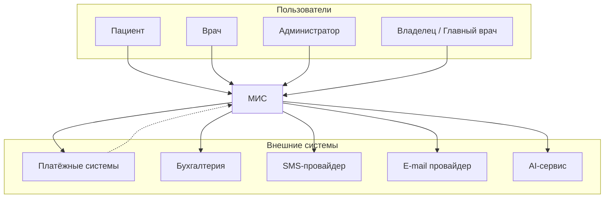
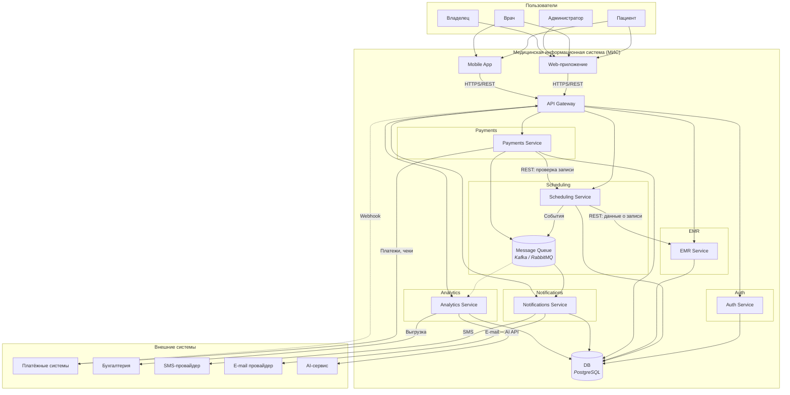

# Архитектурное описание

Архитектурная документация медицинской информационной системы в формате C4: контекст системы (Level 1) и контейнеры (Level 2). Архитектура — **микросервисная**: доменные возможности разнесены по независимо развёртываемым сервисам; используется одна база данных, взаимодействие — через API и шину событий.

---

## 2. Архитектурный контекст (C4 Level 1)

### 2.1. Назначение системы

МИС для сети частных клиник: расписание и запись на приём, онлайн-оплата, медкарты и посещения, уведомления (SMS/e-mail), дашборды и аналитика; интеграция с бухгалтерией и AI-сервисом.

### 2.2. Границы системы

Внутри МИС: Web-приложение, Mobile App, API Gateway, микросервисы (Auth, Scheduling, EMR, Payments, Notifications, Analytics), БД (PostgreSQL), Message Queue. Вне системы: пользователи (пациент, врач, администратор, владелец); платёжные системы, бухгалтерия, SMS/e-mail провайдеры, AI-сервис — интеграция по API, webhooks для платежей.

### 2.3. Диаграмма системного контекста (C4)

---

## 3. Контейнеры системы (C4 Level 2)

Микросервисы и одна БД; взаимодействие через API Gateway (REST) и шину событий.

### 3.1. Диаграмма контейнеров

### 3.2. Описание контейнеров

| Контейнер | Назначение |
|-----------|------------|
| Web-приложение, Mobile App | Интерфейсы для пользователей |
| API Gateway | Точка входа, JWT, маршрутизация, webhooks |
| Auth Service | Аутентификация, RBAC, изоляция по клиникам |
| Scheduling Service | Расписание, слоты, записи, защита от двойной записи |
| EMR Service | Медкарты, посещения, диагнозы, заключения |
| Payments Service | Оплата, фискализация, адаптеры платёжных систем |
| Notifications Service | Уведомления по событиям, шаблоны, SMS/e-mail |
| Analytics Service | Дашборды, отчёты, выгрузка в бухгалтерию, AI |
| DB (PostgreSQL) | Хранение данных всех сервисов |
| Message Queue | Шина событий для уведомлений и аналитики |

---

## 4. Архитектура: детали и решения

### Композиция и связи

Микросервисы (Auth, Scheduling, EMR, Payments, Notifications, Analytics), одна БД (PostgreSQL). Единая точка входа — API Gateway; между сервисами — REST; уведомления и аналитика — через шину событий (Message Queue). Внешние системы (платежи, SMS, e-mail, бухгалтерия, AI) подключаются через адаптеры.

### Хранение и защита данных

Учёт 323-ФЗ, 152-ФЗ и приказов Минздрава: сроки хранения меддокументации, шифрование при передаче и хранении, RBAC и изоляция по клиникам, аудит, размещение БД на территории РФ.

### TODO

Возможно какие-то решения для оптимизаций или в случае ошибок