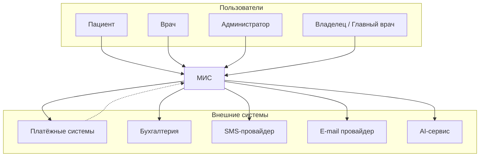
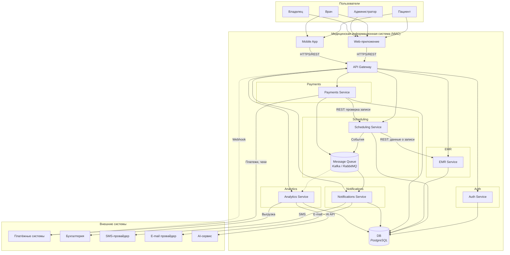
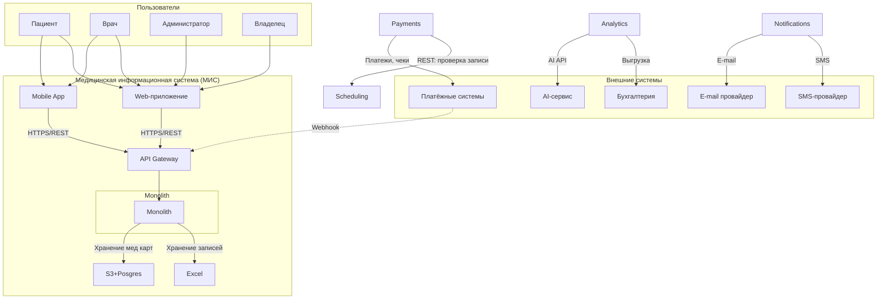
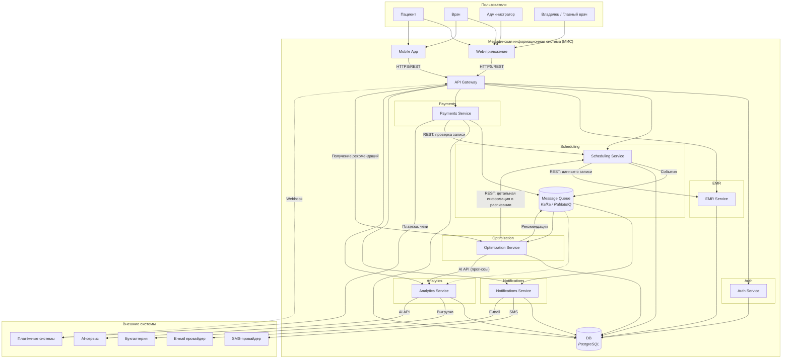

## 1. Архитектурное описание

Архитектурная документация медицинской информационной системы (МИС) в формате C4: контекст системы (Level 1) и контейнеры (Level 2). Архитектура — **микросервисная**: доменные возможности разнесены по независимо развёртываемым сервисам; используется одна база данных, взаимодействие — через API и шину событий.

---

## 1.2. Архитектурный контекст (C4 Level 1)

### 1.2.1. Назначение системы

МИС для сети частных клиник: расписание и запись на приём, онлайн-оплата, медкарты и посещения, уведомления (SMS/e-mail), дашборды и аналитика; интеграция с бухгалтерией и AI-сервисом.

### 1.2.2. Границы системы

Внутри МИС: Web-приложение, Mobile App, API Gateway, микросервисы (Auth, Scheduling, EMR, Payments, Notifications, Analytics), БД (PostgreSQL), Message Queue. Вне системы: пользователи (пациент, врач, администратор, владелец); платёжные системы, бухгалтерия, SMS/e-mail провайдеры, AI-сервис — интеграция по API, webhooks для платежей.

### 1.2.3. Диаграмма системного контекста (C4)

---

## 1.3. Контейнеры системы (C4 Level 2)

Микросервисы и одна БД; взаимодействие через API Gateway (REST) и шину событий.

### 1.3.1. Диаграмма контейнеров

### 1.3.2. Описание контейнеров

| Контейнер | Назначение |
|-----------|------------|
| Web-приложение, Mobile App | Интерфейсы для пользователей |
| API Gateway | Точка входа, JWT, маршрутизация, webhooks |
| Auth Service | Аутентификация, RBAC, изоляция по клиникам |
| Scheduling Service | Расписание, слоты, записи, защита от двойной записи |
| EMR Service | Медкарты, посещения, диагнозы, заключения |
| Payments Service | Оплата, фискализация, адаптеры платёжных систем |
| Notifications Service | Уведомления по событиям, шаблоны, SMS/e-mail |
| Analytics Service | Дашборды, отчёты, выгрузка в бухгалтерию, AI |
| DB (PostgreSQL) | Хранение данных всех сервисов |
| Message Queue | Шина событий для уведомлений и аналитики |

---

## 1.4. Архитектура: детали и решения

### 1.4.1. Композиция и связи

Микросервисы (Auth, Scheduling, EMR, Payments, Notifications, Analytics), одна БД (PostgreSQL). Единая точка входа — API Gateway; между сервисами — REST; уведомления и аналитика — через шину событий (Message Queue). Внешние системы (платежи, SMS, e-mail, бухгалтерия, AI) подключаются через адаптеры.

### 1.4.2. Хранение и защита данных

Учёт 323-ФЗ, 152-ФЗ и приказов Минздрава: сроки хранения меддокументации, шифрование при передаче и хранении, RBAC и изоляция по клиникам, аудит, размещение БД на территории РФ.

## 2. Architecturally Significant Requirement

### 2.1. Архитектурно значимые функциональные требования

1. Поддержка сети клиник (собственных и франшиз) с возможностью гибкой ролевой модели

Влияние на архитектуру:

- Строгая изоляция данных (разграничение аналитической и финансовой информации между филиалами)
- Сложная ролевая система

2. Централизованная аналитика и дашборды

Влияние на архитектуру:

- Нельзя ограничиться одной транзакционной БД
- Аналитическое хранилище

3. Цифровые медицинские карты

Влияние на архитектуру:

- Необходимость выполнений требований регулятора
    - Запрет удаления записей на фиксированное число лет
    - Наличие аудит-лога
    - Доступ до медицинской карты покрыт ролевой моделью
- Хранение больших объемов неструктурированных (медицинских) данных

4. Возможность онлайн-оплаты

Влияние на архитектуру:

- Необходимость выполнений требований регулятора
- Интеграция с внешними платежными сервисами
- Интеграция с 1C и бухгалтерскими сервисами

5. Масштабирование числа посетителей и рост сети

- Горизонтальное масштабирование
- Балансировка нагрузки

### 2.2. Попытка исключения масштабирования числа посетителей и роста сети

Анализ:

* Число посетителей в одной клинике сети - в среднем до 20 человек в день, число клиник 7. Вместо реляционной базы данных для учета записей, свободных слотов врачей и стоимости приема поддерживаем excel таблицу. Нет необходимости поддерживать отдельное аналитическое хранилище для выполнения сложных аналитических запросов, строим графики и дашборды с помощью инструментов excel

    * При этом хранение медицинской информации (медицинских карт, протоколов консультаций) остается в S3 (для больших неструктурированных данных) и Postgres'е из-за требований регулятора

* Достаточно развернуть 1 физический сервер, не требуется балансировка нагрузки. Требуется регулярное выполнение бэкапов медицинских данных для выполнения требований регулятора, однако допустима потеря стабильности

* Нет смысла разделения монолитного сервиса на микросервисы - нагрузка на все элементы системы составляет десятки запросов в час

    * Отказываемся от асинхронной отправки уведомлений в пользу синхронных нотификаций

#### Обновленная диаграмма компонентов

## 3. Верхнеуровневая оценка реализации МИС

### 1. Вводные и допущения

На основе предоставленной архитектуры и бизнес-требований мы принимаем следующие допущения для оценки:

- MVP-функционал: Оценивается создание ядра системы, которое закроет основные потребности: запись к врачу, ведение электронных медкарт, онлайн-оплата, базовые уведомления и дашборды.

- Команда: Ставки рассчитаны для российской команды разработки (руб.).

- Инфраструктура: Оценка включает настройку инфраструктуры (dev/stage/prod контуры) в одном из российских облаков (Yandex.Cloud / Selectel).

- Интеграции: Считаем, что все внешние сервисы (платежные шлюзы, SMS/Email провайдеры) имеют типовое API.

### 2. Этапы реализации

| **Этап** | **Длительность** | **Ключевые работы (Задачи)** | **Результат** |
| :--- | :--- | :--- | :--- |
| **Этап 1: Проектирование и Настройка (Foundation)** | 1.5 - 2 месяца | - **Анализ и Архитектура:** Детализация API, моделей данных, уточнение интеграций (бухгалтерия, AI), выбор стека технологий.  - **DevOps:** Настройка CI/CD, развертывание инфраструктуры (БД, очереди), настройка мониторинга и логирования. | Готовая к разработке среда, настроенные репозитории, утвержденные технические спецификации и план разработки. |
| **Этап 2: Разработка ядра системы (Backbone + Auth)** | 2.5 - 3 месяца | - **API Gateway:** Разработка единой точки входа.   - **Auth Service:** Регистрация/авторизация, ролевая модель (RBAC), изоляция данных по клиникам, валидация JWT.   - **База данных:** Создание схемы и миграции. | Работоспособный и безопасный бэкенд, готовый для подключения пользовательских интерфейсов и бизнес-логики. |
| **Этап 3: Разработка бизнес-логики (Core Features)** | 4 - 5 месяцев | - **Scheduling Service:** Управление расписанием и записью.  - **EMR Service:** Ведение электронных медкарт и протоколов.  - **Payments Service:** Интеграция с эквайрингом и облачной кассой.  - **Web-App:** Разработка интерфейсов для пациентов, врачей и администраторов. | Готовый продукт для запуска пилота (функции: запись, оплата, электронная карта). |
| **Этап 4: Интеграции и Аналитика (Integration & Analytics)** | 2 - 3 месяца | - **Notifications Service:** Подключение SMS/Email провайдеров, настройка шаблонов уведомлений.  - **Analytics Service:** Построение ETL-процессов, разработка дашбордов для руководства.  - **Внешние интеграции:** Адаптеры для бухгалтерии (ERP) и первый контур интеграции с AI-сервисом.  - **Mobile App (MVP):** Сборка облегченной версии приложения (просмотр расписания, запись, уведомления). | Расширение функционала системами уведомлений, аналитики и внешнего взаимодействия. |
| **Этап 5: Внедрение, Миграция данных и Опытная эксплуатация** | 2 - 3 месяца | - **Миграция:** Перенос данных из Excel и бумажных карт.  - **Тестирование:** Нагрузочное тестирование, регресс, приемочное тестирование (UAT).  - **Развертывание:** Выкатка в промышленную среду (production), обучение персонала. | Система, введенная в промышленную эксплуатацию. |

**Общая длительность:** 12 - 16 месяцев

### 3. Оценка трудозатрат (Человеко-месяцы)

Предполагаемый состав команды:

- **PM/PO:** 1 (ведение проекта)
- **System Analyst:** 1 (спецификации)
- **Backend Developers:** 3-4 (Java/Go/Python, Kafka, SQL)
- **Frontend Developers:** 2-3 (React/Vue.js)
- **Mobile Developer:** 1-2 (Flutter/React Native)
- **QA Engineer:** 2 (тестирование)
- **DevOps Engineer:** 1 (частичная занятость)

| Этап | PM | Аналитик | Backend | Frontend | Mobile | QA | DevOps | **Итого (чел.-мес)** |
| :--- | :---: | :---: | :---: | :---: | :---: | :---: | :---: | :---: |
| **Этап 1** | 1 | 2 | 1 | 0.5 | 0 | 0.5 | 2 | **7** |
| **Этап 2** | 1 | 0.5 | 5 | 1 | 0 | 1.5 | 0.5 | **9.5** |
| **Этап 3** | 2 | 1 | 12 | 8 | 2 | 6 | 0.5 | **31.5** |
| **Этап 4** | 1.5 | 1 | 5 | 3 | 3 | 3 | 0.5 | **17** |
| **Этап 5** | 2 | 1 | 2 | 1 | 0.5 | 3 | 1 | **10.5** |
| **ИТОГО** | **7.5** | **5.5** | **25** | **13.5** | **5.5** | **14** | **4.5** | **75.5** |

**Итоговые трудозатраты: ~75 человеко-месяцев.**

---

### 4. Стоимостная оценка (в рублях)

Используем медианные ставки для российской команды (Москва / СПб, имсключая налоги работодателя):

- PM: 150 000 руб./мес  
- Аналитик: 200 000 руб./мес  
- Backend: 280 000 руб./мес  
- Frontend: 260 000 руб./мес  
- Mobile: 280 000 руб./мес  
- QA: 200 000 руб./мес  
- DevOps: 240 000 руб./мес  

| Роль | Месяцев | Ставка (руб./мес, gross) | Сумма gross (руб.) |
| :--- | :---: | ---: | ---: |
| **PM** | 7.5 | 150 000 | 1 125 000 |
| **Аналитик** | 5.5 | 200 000 | 1 100 000 |
| **Backend** | 25 | 280 000 | 7 000 000 |
| **Frontend** | 13.5 | 260 000 | 3 510 000 |
| **Mobile** | 5.5 | 280 000 | 1 540 000 |
| **QA** | 14 | 200 000 | 2 800 000 |
| **DevOps** | 4.5 | 240 000 | 1 080 000 |
| **ИТОГО ФОТ (gross)** | | | **18 155 000 руб.** |
| **Налоговая нагрузка (+30%)** | | | **5 446 500 руб.** |
| **ВСЕГО расходы на сотрудников** | | | **23 601 500 руб.** |

Итоговая стоимость проекта с учётом страховых взносов и налогов: $\approx$ **23 601 500 руб.**

### 5. Дополнительные расходы (не включены в ФОТ)

Помимо разработки необходимо учитывать эксплуатационные и инфраструктурные затраты.

Инфраструктура:

- Cloud (VM, Kubernetes, БД) — ~200 000 - 500 000 руб./год
- Хранение резервных копий
- Мониторинг и логирование

Интеграции:

- Комиссии платежных систем
- SMS-трафик (зависит от объёма отправок)
- API AI-сервиса (если платный)

Техническая поддержка после запуска:

- 1-2 инженера поддержки
- $\approx$ 2-3 млн руб. в год

### 6. Итоговая смета проекта

| Статья расходов | Сумма (руб.) |
| :--- | ---: |
| **Фонд оплаты труда (включая налоги)** | **23 601 500** |
| **Инфраструктура (облачные ресурсы на 1 год)** | 200 000  - 500 000 |
| **Техническая поддержка и сопровождение (1 год)** | 2 000 000  - 3 000 000 |
| **Бюджет на интеграции (SMS, платежные комиссии, AI)** | ~500 000 |
| **Итого (средняя оценка на первый год)** | **~26 500 000  - 27 500 000** |

Полная стоимость создания и первого года эксплуатации МИС составит ориентировочно 27 миллионов рублей.
Точные суммы зависят от выбранного облачного провайдера, тарифов на SMS и объема трафика.

## 4. Учёт нового функционала: автоматическая оптимизация расписания

### 4.1. Описание функциональных требований

Заказчик запросил добавление функциональности, которая позволит системе автоматически оптимизировать расписание при возникновении следующих событий:

- перенос визитов пациентами;
- незапланированное отсутствие врача (например болезнь);
- задержки при приёме (текущий приём затягивается, что сдвигает последующие слоты).

Система должна предлагать администраторам рекомендации по корректировке расписания (перераспределить пациентов к другим врачам, изменить время слотов, предложить альтернативные варианты записи). Рекомендации должны быть основаны на приоритетах пациентов, загруженности врачей, срочности визитов и других ограничениях (в перспективе - с использованием метыодов машинного обучения для предсказания длительности приёма и вероятности неявок).

### 4.2. Влияние на архитектуру

Для реализации данного функционала потребуются изменения как в логике существующих сервисов, так и добавление новых компонентов. Основные изменения:

1. **Новый микросервис - Optimization Service**  
    Отвечает за:

    - Сбор событий, влияющих на расписание (переносы, отмены, болезни, задержки).
    - Запуск алгоритмов оптимизации
    - Генерацию рекомендаций для администраторов.
    - Взаимодействие с сервисом анализа для получения прогнозов (например, ожидаемой длительности приёма, вероятности переноса).

2. **Расширение функциональности Scheduling Service**  

    - Публикация в шину событий всех изменений расписания (создание, перенос, отмена записи, изменение статуса врача).
    - Предоставление API для Optimization Service для получения детальной информации о занятости врачей, слотах, пациентах.

3. **Доработка Notifications Service и WebApp**  

    - Уведомление администраторов о появлении новых рекомендаций (через интерфейс и/или push-уведомления).
    - Уведомление пациентов о смене времени записи.
    - Разработка интерфейса в личном кабинете администратора для просмотра, анализа и применения/отклонения рекомендаций.

4. **Усиление взаимодействия с Analytics Service**  

    - Optimization Service будет регулярно запрашивать у Analytics Service  прогнозы длительности приёмов на основе исторических данных.
    - Возможно, потребуется дообучение моделей под особенности клиники.

5. **Новые архитектурные свойства**  

    - **Производительность и масштабируемость**: алгоритмы оптимизации могут быть вычислительно затратными, особенно при большом количестве слотов и врачей. Optimization Service должен масштабироваться горизонтально и поддерживать асинхронную обработку.
    - **Согласованность данных**: предсказания могут рассчитываться на основе слегка устаревших данных (eventual consistency), но для принятия решений администраторам нужна актуальная картина. Следует обеспечить баланс между скоростью расчёта и точностью.
    - **Отказоустойчивость**: сбой Optimization Service не должен блокировать основную работу расписания. Рекомендации могут накапливаться в очереди и обрабатываться позже.
    - **Расширяемость**: алгоритмы оптимизации должны легко заменяться или дополняться (возможность подключать разные стратегии).

### 4.3. Обновлённая диаграмма контейнеров (C4 Level 2)

На диаграмму добавлен новый контейнер **Optimization Service**, а также изменены связи с ним.

### 4.4. Описание нового контейнера

| Контейнер | Назначение |
|---|---|
| **Optimization Service** | Подписывается на события, связанные с изменениями расписания (переносы, болезни, задержки). Запускает алгоритмы оптимизации (правила или ML) для поиска наилучшего варианта перераспределения слотов. Генерирует рекомендации и публикует их в очередь для уведомления администраторов. При необходимости обращается к сервису аналитики для получения прогнозов (например, ожидаемой длительности приёма). Взаимодействует с Scheduling Service для получения детальных данных о занятости и ограничениях. |

### 4.5. Детали реализации

- **Алгоритмы оптимизации** могут быть реализованы как набор правил (например, если врач заболел, предложить ближайшую свободную замену с учётом специализации) или как более сложные оптимизационные модели (линейное программирование, эвристики). В перспективе возможно использование моделей машинного обучения для предсказания оптимального расписания.
- **Интеграция с Analytics Service**: для прогнозирования длительности приёма или вероятности переноса визита можно использовать имеющийся AI-сервис, расширив его API соответствующими методами.
- **Рекомендации** хранятся в БД (таблица `recommendations`) и доступны через API Gateway для веб-приложения администратора. Каждая рекомендация имеет статус (новая, просмотрена, принята, отклонена).
- **Интерфейс администратора** будет содержать отдельную вкладку «Рекомендации по расписанию» со списком предложений, визуализацией текущей загрузки и возможностью применить рекомендацию (автоматически скорректировать расписание) или отклонить её с комментарием.

### 4.6. Влияние на оценку реализации

Добавление функционала оптимизации расписания потребует увеличения трудозатрат и, соответственно, бюджета проекта. Ниже приведены обновлённые данные.

#### 4.6.1. Дополнительные этапы и работы

Функционал может быть реализован в рамках отдельного этапа или расширения существующих этапов. Рекомендуется выделить подзадачи в Этап 4 (Интеграции и Аналитика) или добавить новый Этап 4а.

| Дополнительные работы | Ориентировочная длительность | Затронутые роли |
|------------------------|-------------------------------|-----------------|
| Проектирование алгоритмов оптимизации и форматов рекомендаций | 0,5 мес | Аналитик, Архитектор |
| Разработка Optimization Service (бэкенд) | 2 мес | Backend-разработчик (1 чел.) |
| Доработка Scheduling Service (публикация событий, API для оптимизатора) | 0,5 мес | Backend-разработчик |
| Интеграция с AI-сервисом (доработка API AI или адаптера) | 0,5 мес | Backend-разработчик |
| Разработка интерфейса администратора для работы с рекомендациями | 1,5 мес | Frontend-разработчик |
| Доработка Notifications Service (уведомления о новых рекомендациях) | 0,3 мес | Backend-разработчик |
| Тестирование (модульное, интеграционное, приёмочное) | 1 мес | QA-инженер |
| **Итого дополнительно** | **~6,3 человеко-месяцев** | |

#### 4.6.2. Дополнительные трудозатраты по ролям

| Роль | Доп. человеко-месяцы |
|------|----------------------|
| Аналитик | 0,5 |
| Backend-разработчик | 3,3 |
| Frontend-разработчик | 1,5 |
| QA-инженер | 1,0 |
| **ИТОГО** | **6,3** |

#### 4.6.3. Обновлённая общая оценка трудозатрат

С учётом добавленных работ общие трудозатраты составят:

- Ранее: 75,5 чел.-мес.
- Дополнительно: 6,3 чел.-мес.
- **Новый итог: 81,8 чел.-мес.**

#### 4.6.4. Обновлённая стоимостная оценка

Дополнительные расходы на ФОТ (с налогами):

| Роль | Доп. мес. | Ставка (руб./мес, gross) | Сумма gross |
|------|-----------|---------------------------|-------------|
| Аналитик | 0,5 | 200 000 | 100 000 |
| Backend | 3,3 | 280 000 | 924 000 |
| Frontend | 1,5 | 260 000 | 390 000 |
| QA | 1,0 | 200 000 | 200 000 |
| **ИТОГО gross** | | | **1 614 000** |
| Налоги (+30%) | | | 484 200 |
| **Всего доп. ФОТ** | | | **2 098 200 руб.** |

Прежняя общая стоимость ФОТ: 23 601 500 руб.  
Новая стоимость ФОТ: 23 601 500 + 2 098 200 = **25 699 700 руб.**

Инфраструктурные расходы возрастут незначительно (дополнительный контейнер Optimization Service, возможно, потребуется больше ресурсов CPU для расчётов). Добавим к инфраструктуре ~100 000 руб./год.

Обновлённая итоговая смета проекта:

| Статья расходов | Сумма (руб.) |
| :--- | ---: |
| **Фонд оплаты труда (включая налоги)** | **25 699 700** |
| **Инфраструктура (облачные ресурсы на 1 год)** | 300 000 - 600 000 |
| **Техническая поддержка и сопровождение (1 год)** | 2 000 000 - 3 000 000 |
| **Бюджет на интеграции (SMS, платежные комиссии, AI)** | ~600 000 |
| **Итого (средняя оценка на первый год)** | **~28,6 - 29,9 млн руб.** |

Таким образом, добавление функционала автоматической оптимизации расписания увеличивает общую стоимость проекта примерно на **2,1 млн руб.** (ФОТ) и требует около **6,3 дополнительных человеко-месяцев** работы команды.

## 5. Учёт нового функционала: возможность работы с системой пациентам и администраторам в офлайн-режиме с последующей синхронизацией

### 5.1. Описание функциональных требований

В оффлайне пациент должен иметь возможность:

* Просматривать свои предстоящие записи
* Просматривать историю посещений
* Просматривать медицинскую карту
* Создавать черновик записи на прием

В оффлайне администратор должен иметь возможность:

* Просматривать расписание врачей
* Просматривать информацию о предстоящих приемах
* Вносить изменения в статус визита (совершен, отменен)
* Создавать и редактировать записи

После восстановления связи:

* Все изменения должны автоматически синхронизироваться с сервером
* Должны обрабатываться конфликты данных

В оффлайне врач должен иметь возможность:

* Вести черновик протокола консультации
* Просматривать медицинскую карту пациентов, чей прием назначен на текущий день

После восстановления связи:

* Черновик протокола консультации должен быть сохранен на удаленный сервер

### 5.2 Влияние на архитектуру

1. Переход от централизованной модели хранения данных к распределенной

* Появление локальной базы данных на стороне клиента для хранения локальных изменений
* Запущен отдельный процесс для синхронизации состояния локального и удаленного хранилищ

2. Необходимость обработки конфликтов

* Пример: 2 администратора оффлайн изменили статус визита на отменен и совершен, соответсвенно. Необходимо на стороне сервера определить статус визита или отправить нотификацию о невозможности определить статус автоматически

3. Необходимость поддержки идемпотентности операций

* Повторная отправка операций должна быть поддержана системай (например, записи не задваивались)

4. Необходимость шифрования данных на стороне клиента

* Засчет того, что клиент больше не stateless

### 5.3 Обновлённая диаграмма контейнеров (C4 Level 2)

```mermaid
flowchart TB
    subgraph users ["Пользователи"]
        Patient["Пациент"]
        Doctor["Врач"]
        Admin["Администратор"]
        Owner["Владелец"]
    end

    subgraph interfaces ["Интерфейсы"]
        subgraph web ["Веб-приложение"]
            WebApp["Web-приложение"]
            LocalDatabase[("Local DB<br/><i>IndexedDB</i>")]
            SyncService["Sync Service"]
            WebApp --> |"Сохранение оффлайн изменений, чтение истории"| LocalDatabase
            SyncService --> |"Получение оффлайн изменений, сохранение обновлений"| LocalDatabase
        end

        subgraph mobile ["Мобильное приложение"]
            Mobile["Mobile App"]
            LocalMobileDatabase[("Local DB<br/><i>SQLite</i>")]
            SyncMobileService["Sync Mobile Service"]
            Mobile --> |"Сохранение оффлайн изменений, чтение истории"| LocalMobileDatabase
            SyncMobileService --> |"Получение оффлайн изменений, сохранение обновлений"| LocalMobileDatabase
        end
    end

    subgraph mis ["Медицинская информационная система (МИС)"]
        SyncRemoteService["Sync Remote Service"]
        API["API Gateway"]

        subgraph svc_auth ["Auth"]
            Auth["Auth Service"]
        end

        subgraph svc_sched ["Scheduling"]
            Scheduling["Scheduling Service"]
            Scheduling -->|"События"| Queue
        end

        subgraph svc_emr ["EMR"]
            EMR["EMR Service"]
        end

        subgraph svc_pay ["Payments"]
            Payments["Payments Service"]
            Payments --> Queue
        end

        subgraph svc_notify ["Notifications"]
            Notifications["Notifications Service"]
            Queue --> Notifications
        end

        subgraph svc_analytics ["Analytics"]
            Analytics["Analytics Service"]
            Queue -.-> Analytics
        end

        subgraph svc_optim ["Optimization"]
            Optimization["Optimization Service"]
            Queue --> Optimization
            Optimization -->|"Рекомендации"| Queue
        end

        DB[("DB<br/><i>PostgreSQL</i>")]
        Queue[("Message Queue<br/><i>Kafka / RabbitMQ</i>")]

        SyncRemoteService --> |"Сохранение оффлайн изменений, получение обновлений"| DB
        Auth --> DB
        Scheduling --> DB
        EMR --> DB
        Payments --> DB
        Notifications --> DB
        Analytics --> DB
        Optimization --> DB
    end

    subgraph external ["Внешние системы"]
        Payment["Платёжные системы"]
        ERP["Бухгалтерия"]
        SMS["SMS-провайдер"]
        Email["E-mail провайдер"]
        AI["AI-сервис"]
    end

    Patient --> WebApp
    Patient --> Mobile
    Doctor --> WebApp
    Doctor --> Mobile
    Admin --> WebApp
    Owner --> WebApp

    WebApp -->|"HTTPS/REST"| API
    Mobile -->|"HTTPS/REST"| API
    SyncService -->|"HTTPS"| API
    SyncMobileService -->|"HTTPS"| API
    API --> |"Обработка оффлайн изменений, получение обновлений"| SyncRemoteService

    API --> Auth
    API --> Scheduling
    API --> EMR
    API --> Payments
    API --> Notifications
    API --> Analytics

    API -->|"Получение рекомендаций"| Optimization

    Scheduling -->|"REST: данные о записи"| EMR
    Payments -->|"REST: проверка записи"| Scheduling
    Optimization -->|"REST: детальная информация о расписании"| Scheduling

    Payments -->|"Платежи, чеки"| Payment
    Analytics -->|"Выгрузка"| ERP
    Notifications -->|"SMS"| SMS
    Notifications -->|"E-mail"| Email
    Analytics -->|"AI API"| AI
    Optimization -->|"AI API (прогнозы)"| Analytics

    Payment -.->|"Webhook"| API
```

### 5.4 Описание новых контейнеров

* LocalDatabase, LocalMobileDatabase - локальные хранилища изменений, в которые попадают изменения совершенные в оффлайне. Также туда попадают обновления, совершенные удаленным сервисом
* SyncService, SyncMobileService - сервисы, запущенные локально, которые отправляют оффлайн изменения в удаленный сервис, а также пуллят изменения, совершенные удаленно
* SyncRemoteService - отвечает за взаимодействие с локальными Sync-сервисами (получение обновлений, отправка изменений), резолвинг конфликтных ситуаций

### 5.5 Детали реализации

1. Локальное хранение данных

Для мобильного приложения - SQLite (стандарт для мобильной разработки, подходит для приложений со структурированными данными), для Web - IndexedDB (подходит для полноценной работы в оффлайне, позволяет хранить большие объекты и данные)

2. Модель синхронизации

* Поддержка локального аудит-лога
* При появлении сети отправка аудит-лога
* Получение актуального состояния (как новых событий, так и итога применения оффлайн-изменений) при появлении сети
* Обновление локальной базы данных

3. Обработка конфликтных ситуаций

* Ручное подтверждение администратором для сложных случаев
* Last write wins для простых ожидаемых конфликтных ситуаций
* Тонкая настройка для конкретных случаев (например, изменение времени слота не позволяет совершить запись в старый слот, даже если запись произошла позже)

4. Ограничения

* Список разрешенных действий четко фиксирован
    * Например, запрещена оффлайн запись на прием, но разрешена поддержка черновика записи
    * Запрещена оффлайн-оплата

### 5.6. Влияние на оценку реализации

#### 5.6.1. Дополнительные этапы и работы

| Дополнительные работы | Ориентировочная длительность | Затронутые роли |
|------------------------|-------------------------------|-----------------|
| Фиксация контрактов оффлайн-обработки событий | 0,5 мес | Аналитик, Архитектор |
| Разработка SyncRemoteService | 1.5 мес | Backend-разработчик (1 чел.) |
| Разработка SyncMobileService | 1 мес | Mobile-разработчик (1 чел.) |
| Разработка SyncService | 1 мес | Backend-разработчик (1 чел.) |
| Тестирование (модульное, интеграционное, приёмочное) | 1 мес | QA-инженер |
| **Итого дополнительно** | **~5 человеко-месяцев** | |

#### 5.6.1. Дополнительные трудозатраты по ролям

| Роль | Доп. мес. | Ставка (руб./мес, gross) | Сумма gross |
|------|-----------|---------------------------|-------------|
| Аналитик | 0,5 | 200 000 | 100 000 |
| Backend | 2.5 | 280 000 | 700 000 |
| Mobile | 1 | 280 000 | 280 000 |
| QA | 1,0 | 200 000 | 200 000 |
| **ИТОГО gross** | | | **1 200 000** |
| Налоги (+30%) | | | 300 000 |
| **Всего доп. ФОТ** | | | **1 500 000 руб.** |

Прежняя общая стоимость ФОТ: 25 699 700 руб руб.
Новая стоимость ФОТ: 25 699 700 руб + 1 500 000 = **27 199 700 руб.**

Инфраструктурные расходы возрастут незначительно (дополнительный контейнер Sync Service). Добавим к инфраструктуре ~100 000 руб./год.

Обновлённая итоговая смета проекта:

| Статья расходов | Сумма (руб.) |
| :--- | ---: |
| **Фонд оплаты труда (включая налоги)** | **27 199 700** |
| **Инфраструктура (облачные ресурсы на 1 год)** | 300 000 - 600 000 |
| **Техническая поддержка и сопровождение (1 год)** | 2 000 000 - 3 000 000 |
| **Бюджет на интеграции (SMS, платежные комиссии, AI)** | ~600 000 |
| **Итого (средняя оценка на первый год)** | **~30,1 - 31,4 млн руб.** |

Таким образом, добавление функциональности офлайн-режима с последующей синхронизацией увеличит общую стоимость проекта примерно на **1.5 млн руб.** (ФОТ) и требует около **5 дополнительных человеко-месяцев** работы команды.

## 6. Учёт нового функционала: проверка страховки ДМС пациента

### 6.1. Описание функциональных требований

Заказчик запросил добавление функциональности проверки страховки ДМС (добровольное медицинское страхование) пациента при записи на приём. Система должна быстро получать результат проверки в одном из трёх вариантов:

- **Полное покрытие** — услуга оплачивается страховой в полном объёме.
- **Частичное покрытие** — страховая оплачивает часть стоимости; остаток оплачивает пациент.
- **Отказ в оплате** — страховая не покрывает услугу; пациент оплачивает полностью.

Требования к поведению:

- При записи на приём доступна **опциональная проверка полиса ДМС** (по инициативе пациента или администратора).
- Результат проверки отображается **пациенту и администратору до завершения записи**, чтобы можно было принять решение об оплате.
- **История статусов ДМС по каждому визиту** хранится в системе (для отчётности и аудита).

Время ответа от страховой — не более **5 секунд** (timeout); при недоступности страховой компании запись на приём проходит без проверки ДМС, в системе выставляется флаг «проверка не выполнена» (graceful degradation).

### 6.2. Влияние на архитектуру

Для реализации данного функционала потребуются изменения в логике существующих сервисов и добавление нового компонента интеграции. Основные изменения:

1. **Новый компонент — Insurance Adapter (адаптер страховых компаний)**  
   Входит в слой интеграций МИС. Отвечает за:
   - Единый внутренний контракт: запрос проверки полиса (пациент, полис, услуга, клиника) → ответ: полное покрытие / частичное покрытие / отказ в оплате (и при необходимости детали: лимит, сумма доплаты).
   - Адаптацию к разным API страховых компаний (несколько провайдеров: СОГАЗ, АльфаСтрахование и т.д.; разные форматы и протоколы).
   - Асинхронный запрос с **timeout 5 сек** и fallback: при недоступности или таймауте возвращать статус «проверка не выполнена», не блокируя запись на приём.

2. **Расширение функциональности Scheduling Service**  
   - При создании или подтверждении записи по запросу пользователя вызов Insurance Adapter для проверки ДМС.
   - Возврат результата проверки в API и отображение в UI до завершения записи.
   - Сохранение результата проверки ДМС по визиту в БД (связь с записью/визитом) для истории и отчётности.

3. **Расширение функциональности Payments Service**  
   - Учёт статуса ДМС по визиту при расчёте оплаты: полное покрытие — без списания с пациента; частичное — доплата пациентом; отказ — полная оплата пациентом.
   - Хранение и использование статусов: ДМС полное покрытие, частичное покрытие, отказ в оплате, проверка не выполнена.

4. **Доработка WebApp и Mobile**  
   - В интерфейсе записи на приём — опция «Проверить страховку ДМС» и отображение результата (полное/частичное/отказ) до подтверждения записи.
   - В личном кабинете администратора — отображение статуса ДМС по визиту и истории проверок.

5. **Новые архитектурные свойства**  
   - **Производительность**: быстрый ответ (≤ 5 сек) требует эффективного вызова внешнего API и строгого timeout; при недоступности страховой — не блокировать сценарий записи.
   - **Расширяемость**: добавление новых страховых провайдеров через провайдер-специфичные адаптеры без изменения контракта для Scheduling и Payments.
   - **Отказоустойчивость**: сбой или недоступность страховой не должны препятствовать записи на приём; обязателен fallback и явный флаг «проверка не выполнена».

### 6.3. Обновлённая диаграмма контейнеров (C4 Level 2)

На диаграмму добавлены контейнер **Insurance Adapter**, внешняя система «Страховые компании (ДМС)», а также связи Scheduling → Insurance Adapter и Insurance Adapter → страховые. Диаграмма отражает полный набор нового функционала: офлайн с синхронизацией (раздел 5), проверка страховки ДМС (раздел 6), автоматическая оптимизация расписания (раздел 4).

```mermaid
flowchart TB
    subgraph users ["Пользователи"]
        Patient["Пациент"]
        Doctor["Врач"]
        Admin["Администратор"]
        Owner["Владелец"]
    end

    subgraph interfaces ["Интерфейсы"]
        subgraph web ["Веб-приложение"]
            WebApp["Web-приложение"]
            LocalDatabase[("Local DB<br/><i>IndexedDB</i>")]
            SyncService["Sync Service"]
            WebApp --> |"Сохранение оффлайн изменений, чтение истории"| LocalDatabase
            SyncService --> |"Получение оффлайн изменений, сохранение обновлений"| LocalDatabase
        end

        subgraph mobile ["Мобильное приложение"]
            Mobile["Mobile App"]
            LocalMobileDatabase[("Local DB<br/><i>SQLite</i>")]
            SyncMobileService["Sync Mobile Service"]
            Mobile --> |"Сохранение оффлайн изменений, чтение истории"| LocalMobileDatabase
            SyncMobileService --> |"Получение оффлайн изменений, сохранение обновлений"| LocalMobileDatabase
        end
    end

    subgraph mis ["Медицинская информационная система (МИС)"]
        SyncRemoteService["Sync Remote Service"]
        API["API Gateway"]

        subgraph svc_auth ["Auth"]
            Auth["Auth Service"]
        end

        subgraph svc_sched ["Scheduling"]
            Scheduling["Scheduling Service"]
            Scheduling -->|"События"| Queue
        end

        subgraph svc_emr ["EMR"]
            EMR["EMR Service"]
        end

        subgraph svc_pay ["Payments"]
            Payments["Payments Service"]
            Payments --> Queue
        end

        subgraph svc_insurance ["Интеграции"]
            InsuranceAdapter["Insurance Adapter<br/><i>проверка ДМС</i>"]
        end

        subgraph svc_notify ["Notifications"]
            Notifications["Notifications Service"]
            Queue --> Notifications
        end

        subgraph svc_analytics ["Analytics"]
            Analytics["Analytics Service"]
            Queue -.-> Analytics
        end

        subgraph svc_optim ["Optimization"]
            Optimization["Optimization Service"]
            Queue --> Optimization
            Optimization -->|"Рекомендации"| Queue
        end

        DB[("DB<br/><i>PostgreSQL</i>")]
        Queue[("Message Queue<br/><i>Kafka / RabbitMQ</i>")]

        SyncRemoteService --> |"Сохранение оффлайн изменений, получение обновлений"| DB
        Auth --> DB
        Scheduling --> DB
        EMR --> DB
        Payments --> DB
        Notifications --> DB
        Analytics --> DB
        Optimization --> DB
        InsuranceAdapter --> DB
    end

    subgraph external ["Внешние системы"]
        Payment["Платёжные системы"]
        ERP["Бухгалтерия"]
        SMS["SMS-провайдер"]
        Email["E-mail провайдер"]
        AI["AI-сервис"]
        Insurance["Страховые компании (ДМС)"]
    end

    Patient --> WebApp
    Patient --> Mobile
    Doctor --> WebApp
    Doctor --> Mobile
    Admin --> WebApp
    Owner --> WebApp

    WebApp -->|"HTTPS/REST"| API
    Mobile -->|"HTTPS/REST"| API
    SyncService -->|"HTTPS"| API
    SyncMobileService -->|"HTTPS"| API
    API --> |"Обработка оффлайн изменений, получение обновлений"| SyncRemoteService

    API --> Auth
    API --> Scheduling
    API --> EMR
    API --> Payments
    API --> Notifications
    API --> Analytics

    API -->|"Получение рекомендаций"| Optimization

    Scheduling -->|"REST: данные о записи"| EMR
    Scheduling -->|"REST: проверка полиса<br/>полное/частичное/отказ"| InsuranceAdapter
    Payments -->|"REST: проверка записи"| Scheduling
    Payments -->|"Статус ДМС по визиту"| Scheduling
    Optimization -->|"REST: детальная информация о расписании"| Scheduling

    InsuranceAdapter -->|"API: проверка полиса<br/>timeout 5 сек"| Insurance

    Payments -->|"Платежи, чеки"| Payment
    Analytics -->|"Выгрузка"| ERP
    Notifications -->|"SMS"| SMS
    Notifications -->|"E-mail"| Email
    Analytics -->|"AI API"| AI
    Optimization -->|"AI API (прогнозы)"| Analytics

    Payment -.->|"Webhook"| API
```

### 6.4. Описание нового контейнера

| Контейнер | Назначение |
|---|---|
| **Insurance Adapter** | Единая точка интеграции со страховыми компаниями (ДМС). Принимает запрос на проверку полиса от Scheduling Service, обращается к API выбранной страховой (через провайдер-специфичные адаптеры), применяет timeout 5 сек и fallback при недоступности. Возвращает результат: полное покрытие / частичное покрытие / отказ в оплате или «проверка не выполнена». Результаты проверок сохраняются в БД для истории по визитам; статус доступен Payments Service для расчёта оплаты. |

### 6.5. Детали реализации

- **Контракт проверки ДМС**: запрос содержит идентификатор пациента, номер полиса (или привязку к страховой), код услуги/клиники; ответ — enum (full_coverage / partial_coverage / denied / check_not_performed) и при частичном покрытии — сумма доплаты, лимит.
- **Timeout и fallback**: вызов API страховой с таймаутом 5 секунд; при таймауте, ошибке сети или HTTP 5xx возвращать «проверка не выполнена», запись на приём при этом не блокируется.
- **Интеграция с разными провайдерами**: для каждой страховой (СОГАЗ, АльфаСтрахование и др.) — отдельный адаптер, маппинг запроса/ответа в единый внутренний формат; выбор провайдера по данным полиса пациента или настройкам клиники.
- **Хранение истории**: таблица (или сущность) `insurance_check_result` с полями: визит/запись, дата проверки, страховой провайдер, результат (полное/частичное/отказ/не выполнена), при необходимости — сумма доплаты; связь с визитом для отчётности и для использования в Payments.
- **Интерфейс**: в форме записи на приём — кнопка «Проверить страховку ДМС», после запроса — отображение результата (полное покрытие / частичное покрытие / отказ в оплате / проверка не выполнена); в карточке визита у администратора — отображение статуса ДМС и истории проверок.

### 6.6. Влияние на оценку реализации

Добавление функционала проверки страховки ДМС потребует увеличения трудозатрат и, соответственно, бюджета проекта. Ниже приведены обновлённые данные.

#### 6.6.1. Дополнительные этапы и работы

Функционал может быть реализован в рамках Этапа 4 (Интеграции и Аналитика) или выделен в отдельную подзадачу.

| Дополнительные работы | Ориентировочная длительность | Затронутые роли |
|------------------------|-------------------------------|-----------------|
| Проектирование контракта с страховыми, маппинг провайдеров | 0,3 мес | Аналитик, Архитектор |
| Разработка Insurance Adapter (backend), интеграция с 1–2 страховыми | 0,8 мес | Backend-разработчик |
| Доработка Scheduling Service / API для вызова проверки ДМС при записи | 0,2 мес | Backend-разработчик |
| Доработка Payments Service (учёт статусов ДМС: полное/частичное/отказ) | 0,3 мес | Backend-разработчик |
| UI: отображение результата проверки ДМС (пациент, администратор) | 0,3 мес | Frontend-разработчик |
| Тестирование (модульное, интеграционное, приёмочное) | 0,3 мес | QA-инженер |
| **Итого дополнительно** | **~2,2 человеко-месяца** | |

#### 6.6.2. Дополнительные трудозатраты по ролям

| Роль | Доп. мес. | Ставка (руб./мес, gross) | Сумма gross |
|------|-----------|---------------------------|-------------|
| Аналитик | 0,3 | 200 000 | 60 000 |
| Backend | 1,3 | 280 000 | 364 000 |
| Frontend | 0,3 | 260 000 | 78 000 |
| QA | 0,3 | 200 000 | 60 000 |
| **ИТОГО gross** | | | **562 000** |
| Налоги (+30%) | | | 168 600 |
| **Всего доп. ФОТ** | | | **730 600 руб.** |

#### 6.6.3. Обновлённая общая оценка трудозатрат

С учётом добавленных работ общие трудозатраты составят:

- Ранее (после офлайна): 80,5 чел.-мес. (75,5 + 6,3 + 5 — из этапов 3, 4, 5).
- Дополнительно по ДМС: 2,2 чел.-мес.
- **Новый итог: ~82,7 чел.-мес.** (в части доработок под новый функционал).

#### 6.6.4. Обновлённая стоимостная оценка

Прежняя общая стоимость ФОТ (после учёта офлайна): 27 199 700 руб.  
Новая стоимость ФОТ: 27 199 700 + 730 600 = **27 930 300 руб.**

Инфраструктурные расходы возрастают незначительно (дополнительные вызовы к внешним API страховых). Бюджет на интеграции можно увеличить на ~50 000 руб./год (тестирование, возможные лицензии/доступ к API страховых).

Обновлённая итоговая смета проекта:

| Статья расходов | Сумма (руб.) |
| :--- | ---: |
| **Фонд оплаты труда (включая налоги)** | **27 930 300** |
| **Инфраструктура (облачные ресурсы на 1 год)** | 300 000 - 600 000 |
| **Техническая поддержка и сопровождение (1 год)** | 2 000 000 - 3 000 000 |
| **Бюджет на интеграции (SMS, платежные комиссии, AI, страховые API)** | ~650 000 |
| **Итого (средняя оценка на первый год)** | **~30,9 - 32,2 млн руб.** |

Таким образом, добавление функционала проверки страховки ДМС увеличивает общую стоимость проекта примерно на **0,73 млн руб.** (ФОТ) и требует около **2,2 дополнительных человеко-месяцев** работы команды.
